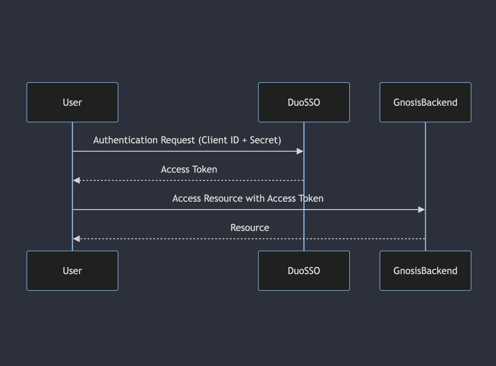

# CXE-ADR0004: Manage Authentication and Authorization

| | |
| -------- | ------- |
| **Status:**  | Published |
| **Author:** | Ivan Virchich, Amine Baba |
| **Date:**    | 2024-01-08 |
| **RFC:**    | N/A |
| **Supersedes:**    | N/A |
| **Deprecates:**    | N/A |

## Context & Problem Statement

Every project requires authentication and authorization and Gnosis is not an exception. In the past company used mix of authz techniques/methods where OAuth 2.0 with PING provider being one of the most popular choices. In the past Gnosis was also using PING.

Fairly recently whole company started switching to Okta or proprietary DUO OAuth 2.0 provides. Where Okta is used for application that are available for Cisco's customers and partners and DUO is for application available for internal only application. Gnosis, being an internal only application, must use DUO provider.

## Decision Drivers

Currently Gnosis relies on BDB-authentication microservice for DUO token validation and introspection. This flow poses a couple of issues:

* Maintenance and update of BDB-authentication library - since BDB-authentication library supports many authentication processes, when developing new features it must ensure that new changes are not affecting existing authentication mechanisms.
* Version control and compatibility - relying on external authentication services can lead to unexpected changes that disrupt our applications. For instance, changes to a critical endpoint by a team not familiar with our specific requirements can cause significant downtime. By owning our authentication library, we maintain complete control over versioning and compatibility, ensuring consistent and stable operations. This control allows us to avoid disruptions and manage updates seamlessly within our environment.
* Unused functionality deployed to Gnosis cluster - BDB-authentication support many authentication processes, like handing TORII/Mashery authentication, authentication using BDB Job ID, etc. None of this functionality is being used by Gnosis.
* Need for maintaining BDB-authentication specific configuration - in every Gnosis cluster we have to maintain a deployment of BDB-authentication and its configuration. Where majority of this configuration is BDB specific, we still have to provide it in order for BDB-authentication to work properly in the cluster.

For Machine-to-Machine (M2M) authentication Gnosis relies on yet another service - CWay OAuth. CWay contains a list of client IDs and passwords that user can use to authenticate to Gnosis. This is less secure option since CWay credentials are not rotated periodically, and it means that we have basic form of authentication in place where users need to pass in request body CWay credentials to obtain token for further M2M calls. The Resource Owner Password Credentials (ROPC) flow is unsuitable for Machine-to-Machine calls because it relies on user credentials, which are not applicable in automated, non-interactive scenarios. Additionally, ROPC poses security risks by requiring the storage of user passwords. The Client Credentials flow is designed for M2M communication, providing a secure method for service authentication using client ID and secret.

Therefore, it is desirable to have a mechanism that will be fully under Gnosis developers' control that would allow us to replace BDB-authentication and CWay, provide desired flexibility, maintainability and security for UI and API authentication.

## Considered Options

*TODO*
In the Considered Options section, we enumerate the different solutions that were evaluated. For instance: "We considered three main options to address our scalability concerns: 1) Refactoring the existing monolithic architecture into a microservices architecture, 2) Scaling vertically by upgrading our server hardware, and 3) Implementing a serverless architecture to allow for on-demand scaling."

## Decision Outcome

Gnosis will use its own library to perform authentication and authorization of users visiting Gnosis via UI or API.

Library will be completely framework independent, only exposing methods or classes that are needed for authentication and authorization. Such independence is necessary in order to ensure easy and quick transition to any other web framework in the future if we ever need to.

Library, while supporting DUO for UI and API authz, will be backward compatible with CWay authentication in order to allow users to fully migrate to DUO authentication. Instead of saving user credentials, as it is now with CWay flow, we will be saving DUO client IDs. Only saved, known, client IDs will be allowed to authenticate to the system. Tokens issued by unknown client IDs will immediately be receiving 403 Forbidden.

For UI authentication the OAuth 2.0 Authorization Code flow with Proof Key for Code Exchange (PKCE) will be used. This flow is ideal for user interfaces because it requires user interaction for login and authorization. This flow enhances security by preventing authorization code interception attacks and is well-suited for single-page applications (SPAs) and mobile apps that cannot securely store client secrets. Flow diagram:

For API, M2M, authentication Client Credentials flow will be used. Machine-to-machine communication involves automated processes with no user interaction. For M2M scenarios, the Client Credentials flow is more appropriate, as it allows backend services to authenticate directly with the authorization server using a client ID and secret, ensuring efficient and secure token access. This flow is specifically designed for server-to-server interactions, making it the best fit for backend communications. Flow diagram:

(The approach will be decided later, either to use library or microservice.)

### Positive Consequences

* Improved security posture by providing secure authentication and authorization for UI and API
* Improved maintainability by consolidating authentication and authorization for whole project to one repository which is fully under Gnosis control

## Resources

*TODO*
Finally, the Resources section provides references and supporting materials that were used to inform the decision. An example might be: "To inform our decision, we consulted various resources including the book 'Building Microservices' by Sam Newman, numerous case studies on microservices adoption by leading tech companies, and performance benchmarks published by cloud service providers. Internal discussions with our development and operations teams also provided valuable insights into the practical implications of the change."
